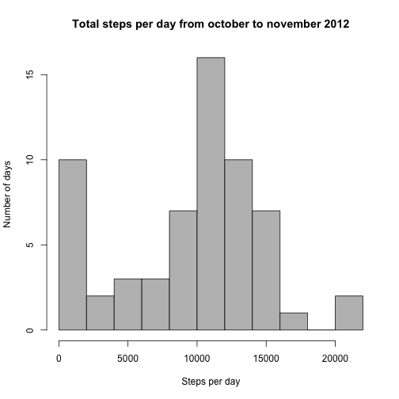
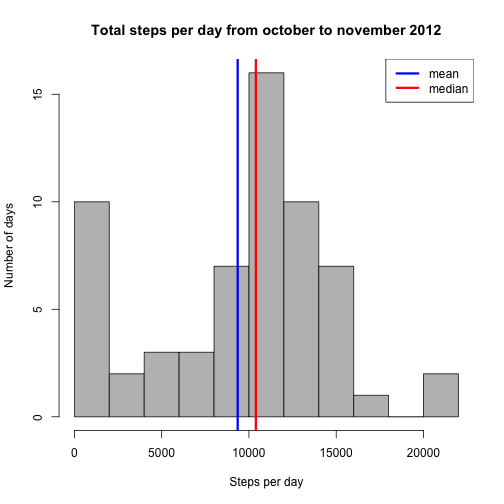
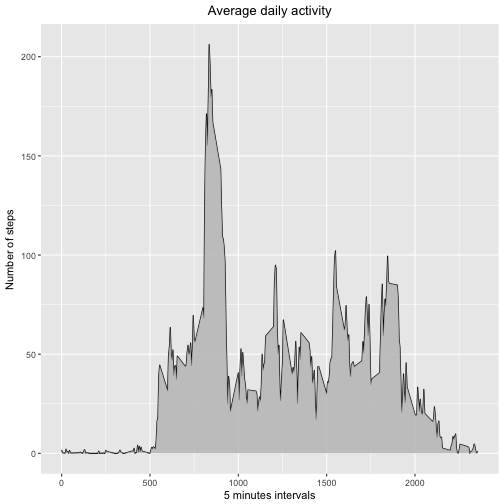
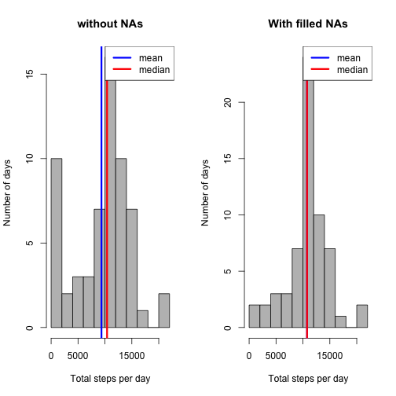
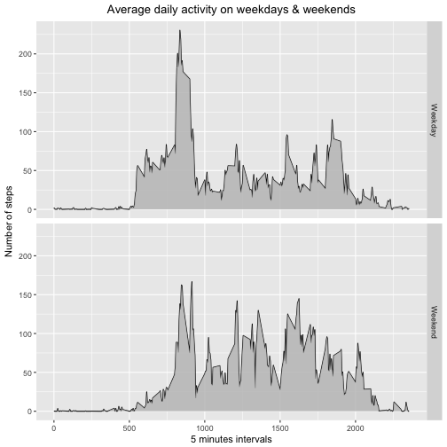

**Introduction**

It is now possible to collect a large amount of data about personal movement using activity monitoring devices such as a Fitbit, Nike Fuelband, or Jawbone Up. These type of devices are part of the “quantified self” movement – a group of enthusiasts who take measurements about themselves regularly to improve their health, to find patterns in their behavior, or because they are tech geeks. But these data remain under-utilized both because the raw data are hard to obtain and there is a lack of statistical methods and software for processing and interpreting the data.

This assignment makes use of data from a personal activity monitoring device. This device collects data at 5 minute intervals through out the day. The data consists of two months of data from an anonymous individual collected during the months of October and November, 2012 and include the number of steps taken in 5 minute intervals each day.

**Required libraries**


```r
library(dplyr)
library(ggplot2)
library(lubridate)
```

Loading and preprocessing the data
==================================


```r
url <- "https://d396qusza40orc.cloudfront.net/repdata%2Fdata%2Factivity.zip"
download.file(url, "Factivity.zip", method = "auto")
unzip <- unzip("Factivity.zip")
activity <- read.csv(unzip)
activity <- tbl_df(activity)
activity
```

```
## # A tibble: 17,568 x 3
##    steps       date interval
##    <int>     <fctr>    <int>
##  1    NA 2012-10-01        0
##  2    NA 2012-10-01        5
##  3    NA 2012-10-01       10
##  4    NA 2012-10-01       15
##  5    NA 2012-10-01       20
##  6    NA 2012-10-01       25
##  7    NA 2012-10-01       30
##  8    NA 2012-10-01       35
##  9    NA 2012-10-01       40
## 10    NA 2012-10-01       45
## # ... with 17,558 more rows
```

The variables included in this dataset are:

1. **steps**: Number of steps taking in a 5-minute interval (missing values are coded as NA ) 
2. **date**: The date on which the measurement was taken in YYYY-MM-DD format 
3. **interval**: Identifier for the 5-minute interval in which measurement was taken

What is mean total number of steps taken per day?
=================================================

**1 : Calculate the total number of steps taken per day**

First, we need to group our *steps* and sum by *day*


```r
sum_dailysteps <- activity %>%
        group_by(date) %>%
        summarize(steps = sum(steps, na.rm = T))
```

It gives us 61 observations of 2 variables, *steps(sum)* and *date*. 

**2 : Make a histogram of the total number of steps taken each day**

Before creating my histogram, I create a shortcut to load my steps variable


```r
dailysteps <- sum_dailysteps$steps
hist(dailysteps, xlab = "Steps per day", ylab = "Number of days", main = "Total steps per day from october to november 2012", breaks = 10, col = "grey")
```



**3 : Calculate and report the mean and median of the total number of steps taken per day**

First part is basic :


```r
mean_ds <- mean(dailysteps)
mean_ds
```

```
## [1] 9354.23
```

```r
median_ds <- median(dailysteps)
median_ds
```

```
## [1] 10395
```

Now, we'd like to report the mean and median on our previous histogram to make it more visual :


```r
hist(dailysteps, xlab = "Steps per day", ylab = "Number of days", main = "Total steps per day from october to november 2012", breaks = 10, col = "grey")
        abline(v=mean_ds, lwd = 3, col = "blue")
        abline(v=median_ds, lwd = 3, col = "red")
        legend("topright", lty = 1, lwd = 3, col = c("blue", "red"), legend = c("mean", "median"))
```



What is the average daily activity pattern?
===========================================

**1 : Make a time series plot (type = "l") of the 5-minute interval (x-axis) and the average number of steps taken, averaged across all days (y-axis)**

As we did previously, we need to group again our data. This time by calculating the *steps* mean by *interval*


```r
mean_intervalsteps <- activity %>%
        group_by(interval) %>%
        summarize(steps = mean(steps, na.rm = TRUE))
```

Once, it's done, I once again create a shortcut to load the variable i need before creating my plot :


```r
intervalsteps <- mean_intervalsteps$steps
ggplot(mean_intervalsteps, aes(x = interval, y = steps)) +
        geom_line() +
        geom_area(fill = "grey", alpha = 0.8) +
        labs(x = "5 minutes intervals", y = "Number of steps", title = "Average daily activity") +
        theme(plot.title = element_text(hjust = 0.5))
```



**2 : Which 5-minute interval, on average across all the days in the dataset, contains the maximum number of steps?**


```r
max_avg_steps <- which.max(intervalsteps)
mean_intervalsteps[max_avg_steps, ]
```

```
## # A tibble: 1 x 2
##   interval    steps
##      <int>    <dbl>
## 1      835 206.1698
```

The 5-minute interval containing the maximum average number of steps across all the days is the interval 835 with 206 steps.

Imputing missing values
=======================

*Note that there are a number of days/intervals where there are missing values (coded as NA). The presence of missing days may introduce bias into some calculations or summaries of the data.*

**1 : Calculate and report the total number of missing values in the dataset (i.e. the total number of rows with NAs)**


```r
table(is.na(activity))
```

```
## 
## FALSE  TRUE 
## 50400  2304
```

So the total number of NAs is 2304, but where is it located ? Is it in the same column ? Let's try with the first column


```r
table(is.na(activity$steps))
```

```
## 
## FALSE  TRUE 
## 15264  2304
```

2304 ! Great, it's all located in the very first variable, *steps*.

**2 : Devise a strategy for filling in all of the missing values in the dataset. The strategy does not need to be sophisticated. For example, you could use the mean/median for that day, or the mean for that 5-minute interval, etc.**

Here, I'll begin with creating a copy of the activity database and then we'll simply use the 5 minute interval mean per day to impute our missing data :


```r
filled.activity <- activity
filled.activity$steps[which(is.na(filled.activity$steps))] <- intervalsteps
```

Let's check if we still have NAs :


```r
table(is.na(filled.activity))
```

```
## 
## FALSE 
## 52704
```

No more NAs in our new data !

**4 : Make a histogram of the total number of steps taken each day and Calculate and report the mean and median total number of steps taken per day.

Let's start by summing our *steps* by *day* :


```r
sum_filled <- filled.activity %>%
        group_by(date) %>%
        summarize(steps = sum(steps))
```

We'll also need our mean and median values to compare our two plots


```r
filled <- sum_filled$steps
mean_filled <- mean(filled)
mean_filled
```

```
## [1] 10766.19
```

```r
median_filled <- median(filled)
median_filled
```

```
## [1] 10766.19
```

Now we can plot to use a visual in order to compare our estimates from the first part


```r
par(mfrow = c(1,2))
        hist(dailysteps, xlab = "Total steps per day", ylab = "Number of days", main = "without NAs", breaks = 10, col = "grey")
                abline(v=mean_ds, lwd = 3, col = "blue")
                abline(v=median_ds, lwd = 3, col = "red")
                legend("topright", lty = 1, lwd = 3, col = c("blue", "red"), legend = c("mean", "median"))
        
        hist(filled, xlab = "Total steps per day", ylab = "Number of days", main = "With filled NAs", breaks = 10, col = "grey")
                abline(v=mean_filled, lwd = 3, col = "blue")
                abline(v=median_filled, lwd = 3, col = "red")
                legend("topright", lty = 1, lwd = 3, col = c("blue", "red"), legend = c("mean", "median"))
```



*Do these values differ from the estimates from the first part of the assignment?* 

They do differ, we clearly see the number of days with less than 2000 steps has lowered from 10 to 2 days. The histogram keeps the same wave but the number of days around 10000 steps per day has increased.

*What is the impact of imputing missing data on the estimates of the total daily number of steps?*

Imputing data increased the average number of steps per day (it passed from 9354 to 10766) and we can see a bigger density of days around 10000 steps per day than it used to be when we removed NAs.

Are there differences in activity patterns between weekdays and weekends?
=========================================================================

**1 : Create a new factor variable in the dataset with two levels – “weekday” and “weekend” indicating whether a given date is a weekday or weekend day.**

We'll start by converting our date column class


```r
class(filled.activity$date)
```

```
## [1] "factor"
```

```r
filled.activity$date <- as.Date(filled.activity$date)
class(filled.activity$date)
```

```
## [1] "Date"
```

Then we use the wday() function and create a new column giving the corresponding weekday of the date. You'll see the results are written in french, "Lun" goes for "Mon" etc


```r
filled.activity$day <- wday(filled.activity$date, label = T)
head(filled.activity)
```

```
## # A tibble: 6 x 4
##       steps       date interval   day
##       <dbl>     <date>    <int> <ord>
## 1 1.7169811 2012-10-01        0   Lun
## 2 0.3396226 2012-10-01        5   Lun
## 3 0.1320755 2012-10-01       10   Lun
## 4 0.1509434 2012-10-01       15   Lun
## 5 0.0754717 2012-10-01       20   Lun
## 6 2.0943396 2012-10-01       25   Lun
```

We still have to work on our data as we're asked to create a "weekday" and "weekend" factor, we'll create a new function to solve this problem :


```r
period <- function(x) {
        if (x %in% c("Lun", "Mar", "Mer", "Jeu", "Ven"))
                return("Weekday")
        else if (x %in% c("Sam", "Dim"))
                return("Weekend")        
}
```

Let's use it to create a new column :


```r
filled.activity$period <- sapply(filled.activity$day, FUN = period)
head(filled.activity)
```

```
## # A tibble: 6 x 5
##       steps       date interval   day  period
##       <dbl>     <date>    <int> <ord>   <chr>
## 1 1.7169811 2012-10-01        0   Lun Weekday
## 2 0.3396226 2012-10-01        5   Lun Weekday
## 3 0.1320755 2012-10-01       10   Lun Weekday
## 4 0.1509434 2012-10-01       15   Lun Weekday
## 5 0.0754717 2012-10-01       20   Lun Weekday
## 6 2.0943396 2012-10-01       25   Lun Weekday
```

Now we can calculate the mean for each interval per day and group by period


```r
mean_filled_period <- filled.activity %>%
        group_by(interval, period) %>%
        summarize(steps = mean(steps))
head(mean_filled_period)
```

```
## # A tibble: 6 x 3
## # Groups:   interval [3]
##   interval  period      steps
##      <int>   <chr>      <dbl>
## 1        0 Weekday 2.25115304
## 2        0 Weekend 0.21462264
## 3        5 Weekday 0.44528302
## 4        5 Weekend 0.04245283
## 5       10 Weekday 0.17316562
## 6       10 Weekend 0.01650943
```

It's the dataframe we needed to build the final plot : 


```r
ggplot(mean_filled_period, aes(x = interval, y = steps)) +
        geom_line() +
        geom_area(fill = "grey", alpha = 0.8) +
        facet_grid(period ~ .) +
        labs(x = "5 minutes intervals", y = "Number of steps", title = "Average daily activity on weekdays & weekends") +
        theme(plot.title = element_text(hjust = 0.5))
```


